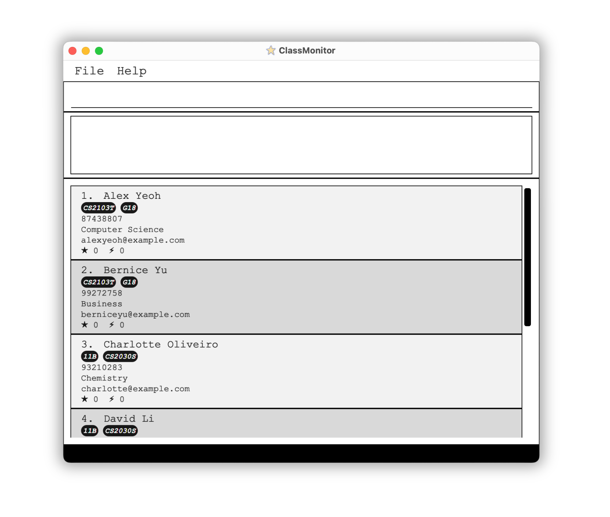

**ClassMonitor is a desktop application for managing your student details.** While it has a GUI, most of the user interactions happen using a CLI (Command Line Interface).

* If you are interested in using ClassMonitor, head over to the [_Quick Start_ section of the **User Guide**](UserGuide.html#quick-start).
* If you are interested about developing ClassMonitor, the [**Developer Guide**](DeveloperGuide.html) is a good place to start.

**Acknowledgements**

ClassMonitor is a brownfield software project based off [AddressBook Level-3](https://se-education.org/addressbook-level3/), taken under the [CS2103T Software Engineering module](https://nus-cs2103-ay2324s1.github.io/website/index.html) held by the School of Computing at the National University of Singapore.

Java dependencies:
* [Jackson](https://github.com/FasterXML/jackson) for JSON-related operations
* [JavaFX](https://openjfx.io/) for GUI
* [JUnit5](https://github.com/junit-team/junit5) for testing

Documentation dependencies:
* [Jekyll](https://jekyllrb.com/) for rendering the website
* [PlantUML](https://plantuml.com/) for creating UML diagrams

Fonts used in ClassMonitor:
* ClassMonitor Website:
    * [Epilogue](https://fonts.google.com/specimen/Epilogue) by Tyler Finck
    * [Source Code Pro](https://fonts.google.com/specimen/Source+Code+Pro) by Paul D. Hunt

Other acknowledgments:
* Material Design Icons:
    * [star](https://www.canva.com/p/sketchify/?utm_medium=referral&utm_source=creator_share&utm_campaign=creator_share) by Sketchify on Canva as ClassMonitor's App Icon
* Font Awesome 6 icons:
    * [book](https://fontawesome.com/icons/book) as the "note" admonition icon
    * [circle-info](https://fontawesome.com/icons/circle-info) as the "info" admonition icon
    * [fire-flame-curved](https://fontawesome.com/icons/fire-flame-curved) as the "danger" admonition icon
    * [lightbulb](https://fontawesome.com/icons/lightbulb) as the "tip" admonition icon
    * [triangle-exclamation](https://fontawesome.com/icons/triangle-exclamation) as the "warning" admonition icon
* Code acknowledgements:
    * [Website Layout](https://github.com/AY2324S2-CS2103T-F13-4/tp/tree/master/docs) adapted from [AY2223S1-CS2103T-W16-2's tP Project](https://github.com/AY2223S1-CS2103T-W16-2/tp/tree/master/docs)
    * [Custom link fragment checker](https://github.com/AY2223S1-CS2103T-W16-2/tp/blob/master/cli-test/linkchecker/check-links.js) adapted from the [World Wide Web Consortium](https://github.com/w3c/node-linkchecker)
    * [Pure CSS auto-incrementing heading counters](https://github.com/AY2223S1-CS2103T-W16-2/tp/blob/master/docs/_sass/toc.scss) adapted from [@gvgramazio on StackOverflow](https://stackoverflow.com/a/51007932/9311854)
    * [PDF styling of HTML pages](https://github.com/AY2223S1-CS2103T-W16-2/tp/blob/master/docs/_sass/pdf.scss) following Michael Perrin's [tutorial](https://www.michaelperrin.fr/blog/2019/11/printing-the-web-part-2-html-and-css-for-printing-books)
    * [Pure liquid admonitions](https://github.com/AY2223S1-CS2103T-W16-2/tp/blob/master/docs/_sass/admonitions.scss) adapted from [@kimkyunghwan21 on GitHub](https://github.com/kimkyunghwan21/kimkyunghwan21.github.io/blob/master/_layouts/plugins/extension.liquid)
    * [Pure liquid HTML table-of-contents](https://github.com/AY2223S1-CS2103T-W16-2/tp/blob/master/docs/_includes/toc.html) from [@allejo on GitHub](https://github.com/allejo/jekyll-toc)
* Miscellaneous:
    * [Docusaurus](https://docusaurus.io/docs/markdown-features/admonitions) for admonition colors and styling
    * [SchemeColor](https://www.schemecolor.com/pastel-rainbow.php) for admonition colors
